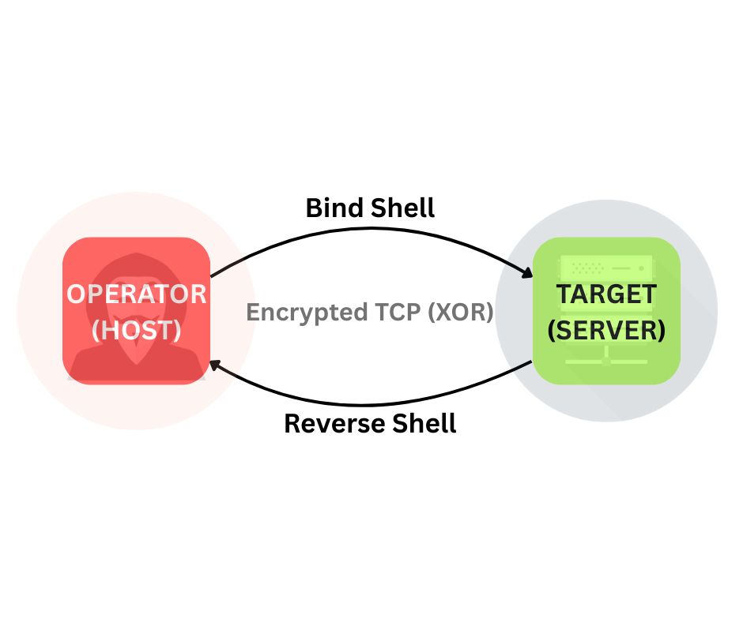
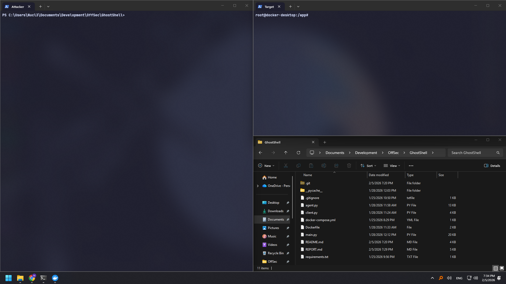
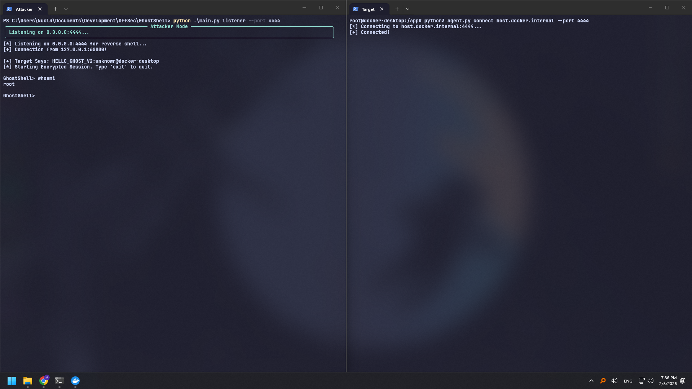
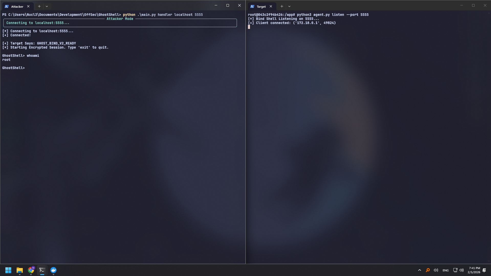
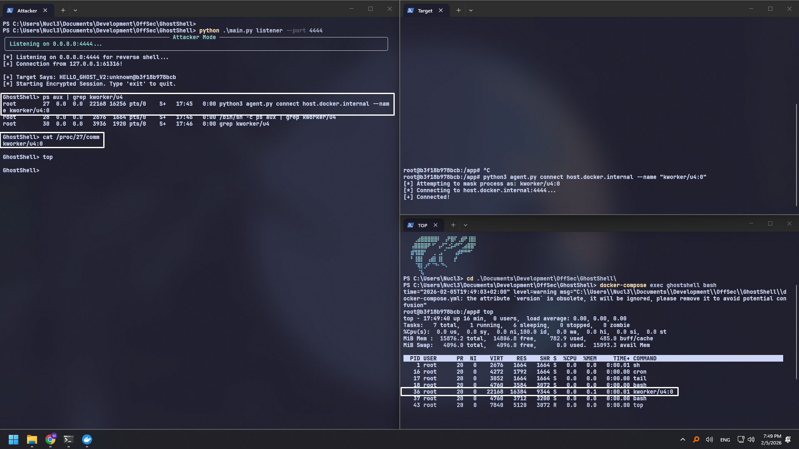
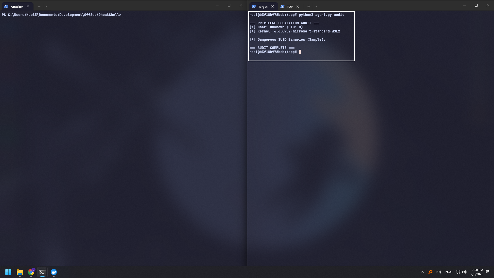
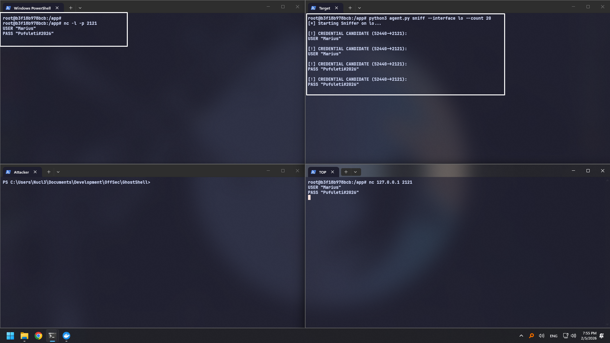
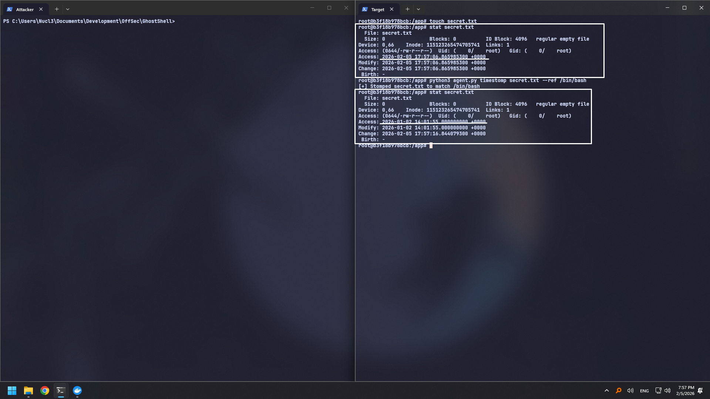
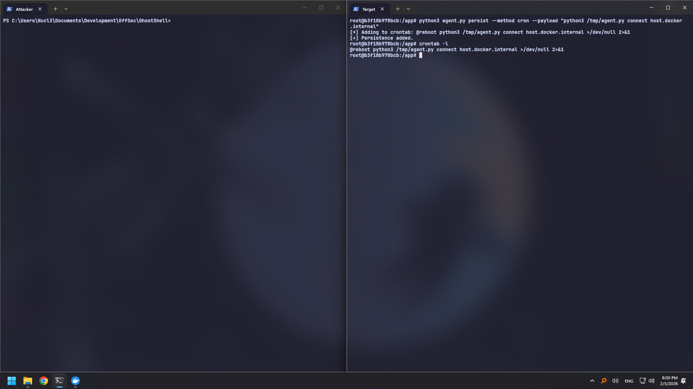

# GhostShell Project Report

> **Purpose:** This document is a structured report template for the GhostShell project. It is designed to include screenshots and images illustrating features, workflows, and test results.

---

## Table of Contents

1. [Overview](#overview)
2. [Objectives](#objectives)
3. [Architecture](#architecture)
4. [Environment & Test Lab](#environment--test-lab)
5. [Features Demonstration](#features-demonstration)
6. [Security & Ethical Use](#security--ethical-use)
7. [Limitations](#limitations)
8. [Future Work](#future-work)

---

## Overview

GhostShell is a lightweight post-exploitation framework focused on educational Red Team workflows. It is split into a **Controller** (`main.py`) and a **Zero-Dependency Agent** (`agent.py`).

The project aims to simulate a realistic C2 (Command & Control) scenario where an operator interacts with a compromised target. It prioritizes stealth (via process masquerading and timestomping) and ease of deployment (using standard libraries only). The framework demonstrates core concepts like reverse/bind shells, persistence mechanisms, and basic forensic evasion.

---

## Objectives

- Provide a modular post-exploitation workflow for training and research.
- Demonstrate safe, controlled testing in an isolated environment.
- Offer a minimal dependency footprint for the agent.

---

## Architecture

**Components:**
- **Controller (`main.py`)**: Operator interface and orchestration.
- **Agent (`agent.py`)**: Payload executed on the target.

**Diagram / Screenshot Placeholder:**

---

## Environment & Test Lab

**Host OS:** _e.g., Windows 11 / Ubuntu 22.04_  
**Python Version:** _e.g., 3.11_  
**Docker:** _e.g., Docker Desktop 4.x_  

**Lab Setup Screenshot:**

---

## Features Demonstration

Below are example sections for documenting features. Replace placeholders with your own screenshots and short notes.

### 1) Reverse Shell

**Description:** Target initiates a connection to the operator.

**Notes:**
- The agent successfully connected back to the listener.
- Useful for bypassing inbound firewall restrictions.
- Connection remained stable during command execution.

---

### 2) Bind Shell

**Description:** Target listens; operator connects.

**Notes:**
- The agent opened the specified port on the target.
- Requires the target to have the port accessible (no firewall blocking).
- Good fallback if reverse connections are blocked.

---

### 3) Process Masquerading

**Description:** Agent process name is customized to blend in.

**Notes:**
- Process name changed to `kworker/u4:0` (or custom name).
- Verified using `ps aux` or `top`.
- Hides the malicious nature of the python script in process listings.

---

### 4) Local Audit

**Description:** Quick checks for kernel vulnerabilities and risky SUID binaries.

**Notes:**
- Identified Kernel version and potential exploits (e.g., Dirty Pipe).
- Listed binaries with SUID bit set, highlighting potential GTFOBins vectors.
- Fast and automated reconnaissance.

---

### 5) Network Sniffer

**Description:** Captures cleartext traffic (root required).

**Notes:**
- Captured raw packets on the specified interface.
- Successfully extracted potential credentials (simulated/real traffic).
- Requires root privileges to open raw sockets.

---

### 6) Timestomping

**Description:** Modifies file timestamps to match a reference.

**Notes:**
- Modified Access and Modify times of the target file.
- Matched timestamps with `/bin/bash` (or reference file).
- Verified changes using `stat` or `ls -l`.

---

### 7) Persistence

**Description:** Agent is configured to run on system reboot.

**Notes:**
- Created a systemd service or cron job for auto-start.
- Verified service status or crontab entry.
- Ensures the agent reconnects after a system reboot.

---

## Security & Ethical Use

GhostShell is intended **strictly for educational and authorized testing**. Use only in environments where explicit permission has been granted.

---

## Limitations

- **Process Masquerading:** The `prctl` method changes the process name visible in tools like `top` or `/proc/pid/comm`, but `ps aux` may still reveal the full command line arguments (e.g., `python3 agent.py ...`).
- **Platform Dependency:** The Agent is optimized for Linux (specifically for Sniffer, Masquerading, and Persistence). Windows support for these specific features is limited or non-existent in the current `agent.py`.
- **Encryption:** Communication uses a static XOR key (`GHOST`), which is sufficient for obfuscation but not secure against determined cryptanalysis.
- **Docker Networking:** On non-Linux hosts (Windows/macOS), the `host` network driver is restricted. Explicit port mapping (Bridge mode) is required for Bind Shells to be reachable from the host.

---

## Future Work

- **Enhanced Cryptography:** Replace static XOR with Diffie-Hellman key exchange and AES encryption for secure communications.
- **Windows Agent:** Develop a dedicated PowerShell or Python-based agent fully compatible with Windows APIs (Service Manager, Registry Persistence).
- **File Transfer:** Implement commands to upload/download files between Controller and Agent.
- **Dynamic Module Loading:** Allow the Agent to fetch and execute Python scripts from memory without touching the disk (Reflective Loading).

---

---

### Notes on Images

- Store images under `docs/images/` for consistent paths.
- Use descriptive names like `reverse-shell.png`, `audit.png`, etc.
- If you keep images elsewhere, update the paths accordingly.
